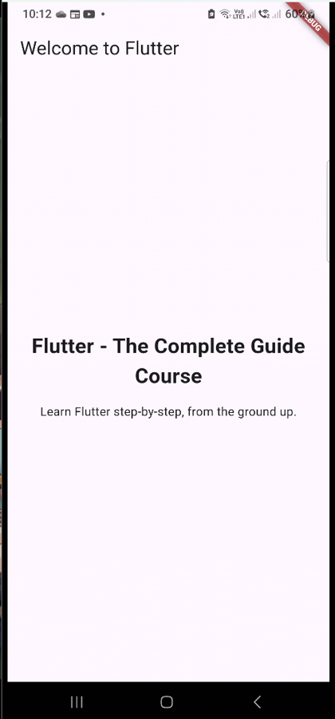

# The First App 
 

## About
The first app from the Flutter course on Udemy.
The app acts as a basic look at what flutter is and how to work with it.

## Images
<table>
  <tr>
    <th>Screen Name</th>
    <th>Screenshot</th>
  </tr>
  <tr>
    <td><strong>Main Screen</strong></td>
    <td></td>
  </tr>

</table>
